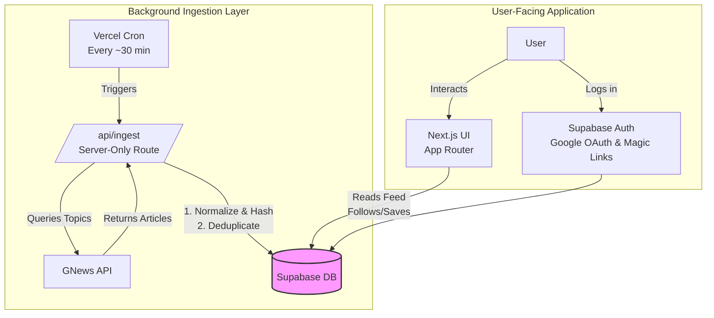
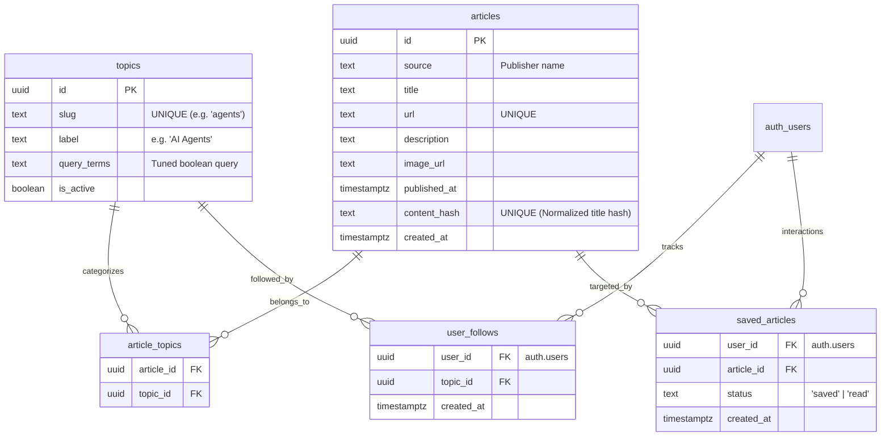

# AI News Architecture Document

This document outlines the detailed system architecture, technology stack, and data model for **AI News**, a de-duplicated AI news tracker.

## 1. Technology Stack

| Layer | Technology | Rationale |
|---|---|---|
| **Frontend & Backend** | Next.js (App Router) | Unified framework for server and client execution. Ideal for server-rendering feed lists and API routes. |
| **Database & Auth** | Supabase (PostgreSQL) | Fully-managed DB with Google OAuth and email magic-link authentication. Provides frictionless onboarding with a passwordless fallback. |
| **Data Source** | GNews API | Multi-source aggregator with generous free tier and clean deployment footprint (no localhost-only restrictions). |
| **Task Scheduling** | Vercel Cron | Triggers the data ingestion cycle in the background. |
| **Hosting** | Vercel | Seamless Next.js deployment and native support for serverless cron jobs. |

## 2. System Architecture

The core architectural philosophy of AI News is **separating ingestion from reads**. We never query the live GNews API during a user page load. Instead, the live API acts as a background data source, and Supabase serves as the primary read replica for the application.

### Architecture Diagram

### 2.1 Background Ingestion Flow
1. **Trigger:** Vercel Cron hits `/api/ingest` every 30 minutes.
2. **Fetch:** The route loops through active topics and queries the GNews API using the tuned boolean `query_terms`.
3. **De-duplication:** Articles are normalized (lowercased, punctuation/whitespace stripped) and hashed (`content_hash`). 
4. **Persist:** The system attempts to insert the article. If the hash already exists in the database, it skips the insert, preventing duplicate or highly similar stories from cluttering the feed.

### 2.2 Client Read Flow
1. **Authentication:** Users authenticate via Google OAuth or Supabase email magic-links.
2. **Feed Generation:** Next.js server components read directly from the `articles` table in Supabase, filtered by the user's followed topics (via `user_follows`).
3. **Performance:** Because reads are served directly from indexed Postgres tables and not an external API, page loads are near-instantaneous.

## 3. Data Model

The application uses a PostgreSQL relational database managed by Supabase.

### De-duplication Strategy
The `content_hash` field on the `articles` table is the crux of the de-duplication engine. 
- A uniqueness constraint on this column at the database level ensures data integrity.
- In v1, this relies on exact/near-exact title matching. Future iterations (v2) may introduce embeddings and vector similarity to catch paraphrased variants.

## 4. Security & Environment Configuration

- **API Keys:** The GNews API key must be stored securely in Vercel Environment Variables. It is strictly accessed server-side within the `/api/ingest` route and is **never** exposed to the client bundle.
- **Database Access:** Supabase Row Level Security (RLS) policies should be configured to ensure users can only modify their own `user_follows` and `saved_articles` records.

## 5. Deployment Constraints & Risks

- **Rate Limits:** GNews free tier allows ~100 requests/day. At 6 topics queried every 30 minutes (288 requests/day), this limit will be breached. **Mitigation:** The cron interval must be tuned (e.g., hourly) or queries batched to stay within limits.
- **Commercial Use:** GNews free tier terms of service prohibit commercial use. Ensure the project remains a non-commercial portfolio demo, or upgrade to a paid tier if monetizing.
